# Описание проекта
## Для выполнения работы использовались следующие инсрументы и утилиты:

- terraform (яндекс provider)
- ansible
- pip3
- git
- kubectl
- yc

Для хранения приложения используется GitHub - [jenkins-docker-maven-java-webapp](https://github.com/pasqueque/jenkins-docker-maven-java-webapp)
Для хранения образов использовался Docker Hub.

Для работы с яндекс облаком через терраформ необходимы аккаунт Yandex Cloud и Service Account. 
Токены для работы с облаком формировались вручную и сохранялись в переменные окружения:
```
$export YC_TOKEN=$(yc iam create-token) #IAM-токен
export YC_CLOUD_ID=$(yc config get cloud-id)
export YC_FOLDER_ID=$(yc config get folder-id)
```

Для установки kubespray через ansible также использовалась переменная окружения - ANSIBLE_CONFIG=./infra_iac/kubespray/ansible.cfg


При разворачивании инфраструктуры через terraform на облачных машинах создается пользовать cadm из файла [meta.txt](./infra_iac/meta.txt). Доступ к машинам производится с помощью закрытого ssh ключа. 


## В результате выполнения работы сделано:

- В Яндекс облаке создан бакет (создан вручную).

- В папке infra-iac описывается все создание инфраструктуры:

- Для удобной работы с разными средами, созданы два workspace:
```
terraform workspace new stage
terraform workspace new prod
```

- Для разворачивания необходимой инфраструктуры необходимо переключиться на нужный workspace и применить
```
terraform workspace select prod 
terraform init
terraform apply
```

### Манифесты терраформ:

+ 00-prepare.tf - скачивает git-репозиторий Kubespray и устанавливает необходимые пакеты Python из зависимостей
+ 10-network.tf - настройки сети
+ 20-compute.tf - разворачивание виртуальных машины для кластера
+ 30-inventory.tf - подготовка файлов инвентаризации для Ansible из шаблона
+ 40-k8s.tf - разворачивание Kubernetes и сохранение конфигурационного файла  kubectl в зависимости от workspace
+ 50-jenkins.tf - в воркспейсе prod разворачивается Jenkins c подготовленными pipeline из шаблонов
+ 60-app.tf - разворачивает приложение из образа в кластере.
+ 70-monitoring - разворачивает в кластере kube-prometheus
+ outputs.tf - выводит в консоль IP нод и ссылки на тестовое приложение, Grafana, Jenkins
+ providers.tf - настройки провайдера
+ variables.tf - переменные, требует файла .auto.tfvars с учетными данными для доступа к сервисам.
Папка ansible - содержит плейбуки, сгенерированные при применении манифестов Terraform

### Папка kubeconfig содержит конфиги кластера в зависимости от workspace.

### Папка templates содержит шаблоны:

+ inventory.tpl - шаблон файла инфентаризации для Ansible
+ playbook.tpl - шаблон плейбука для сохранения конфигурационного файла kubectl
+ supplementary_addresses_in_ssl_keys.tpl - шаблон конфигурации kubespray, чтобы сделать доступным обращения по внешнему IP кластера
+ exported-credentials.tpl - шаблон XML для импорта Jenkins Credentials с реквизитами DockerHub
+ app-deployment.tpl - шаблона манифеста тестового приложения для Kubernetes
+ diploma-test-app-stage-config.tpl - шаблон задания Jenkins для окружения stage
+ diploma-test-app-prod-config.tpl - шаблон задания Jenkins для окружения prod

### Кластер Kubernetes разворачивается через terraform, Конфигурация в prepare.tf, для доступа к кластеру используются шаблоны. 

## CI/CD 

Jenkins разворачивается в кластере, но возникли проблемы с dind, в результате чего он был развернут локально в docker, сборка производится локально и уже деплой производится в кластер.

### Для сборки используются два Jenkinfile:

Для stage среды - образ собирается и пушится в docker hub: 

 [jenkins-docker-maven-java-webapp/Jenkinsfile](https://github.com/pasqueque/jenkins-docker-maven-java-webapp/blob/master/Jenkinsfile)

Для прод среды - образ деплоится в kebernetes, multibranch pipeline отслеживает новый релиз в репозитории по меткам tag:

[jenkins-docker-maven-java-webapp/Jenkinsfile-prod](https://github.com/pasqueque/jenkins-docker-maven-java-webapp/blob/master/Jenkinsfile-prod)

После сборки билдится образ с помощью Dockerfile и пушиться в dockerhub:

[jenkins-docker-maven-java-webapp/Dockerfile](https://github.com/pasqueque/jenkins-docker-maven-java-webapp/blob/master/Dockerfile)

## Скриншоты:
 
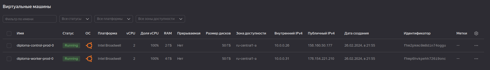

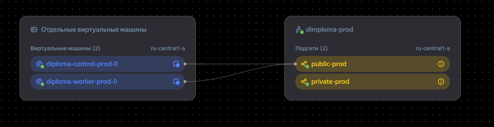

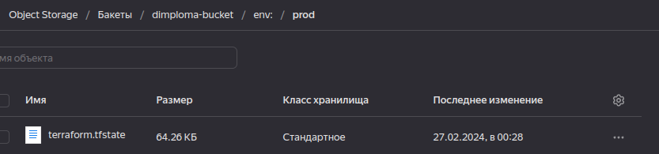

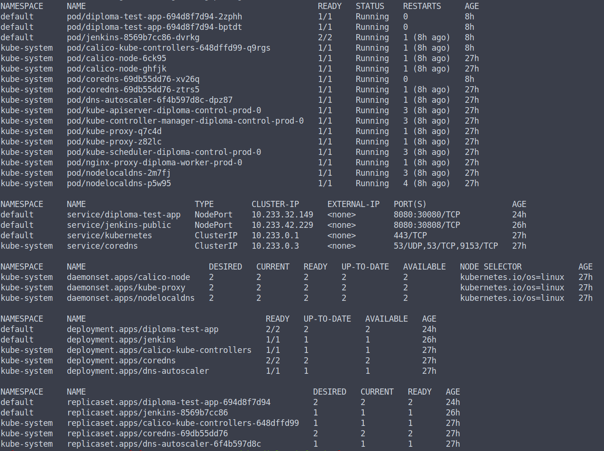

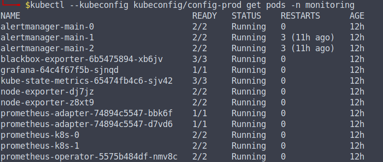

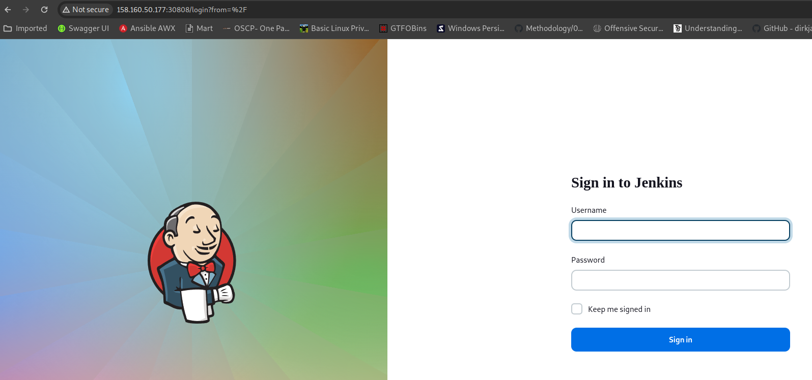

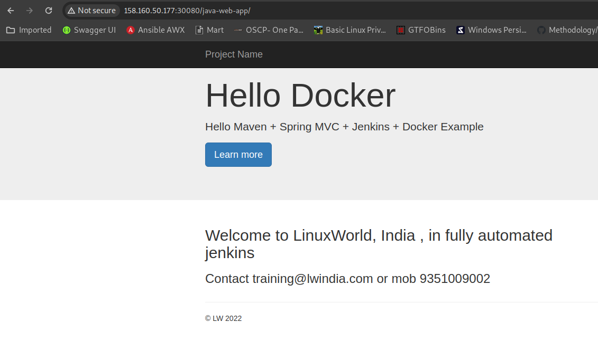

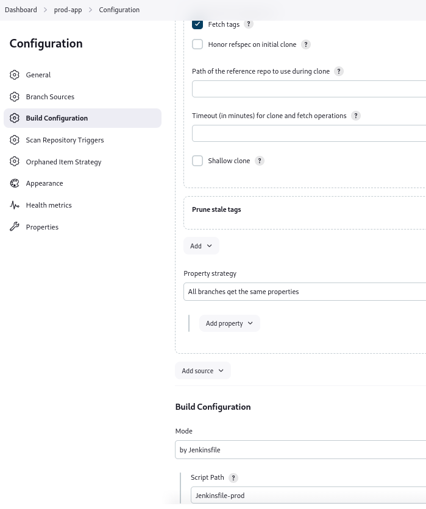

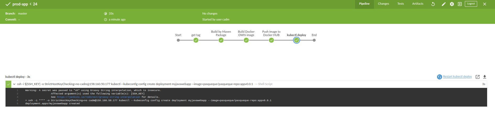

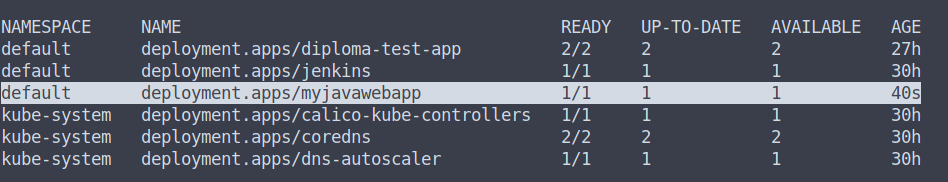

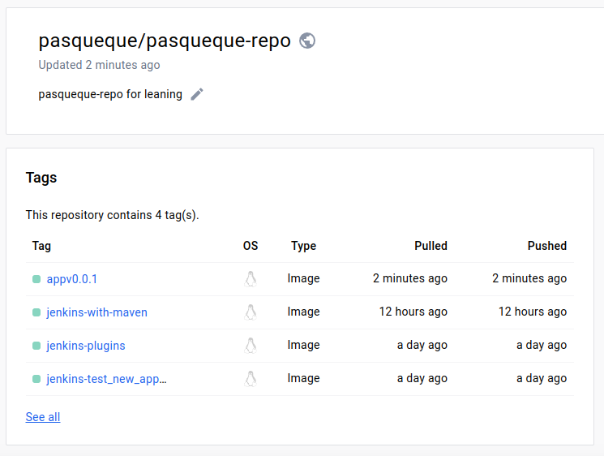


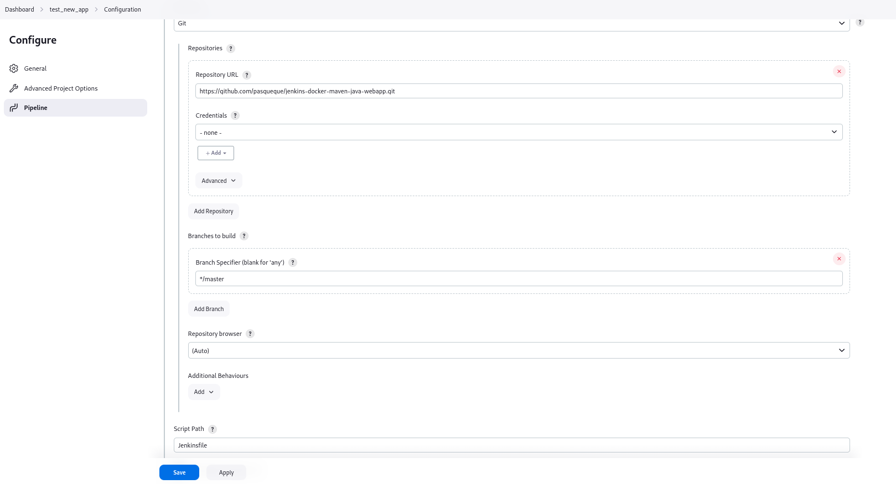

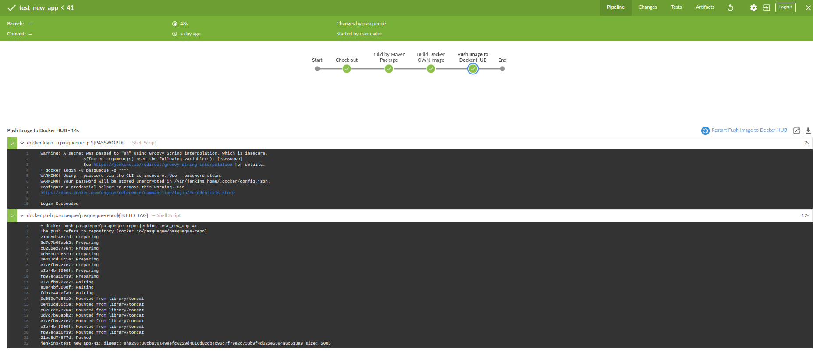
